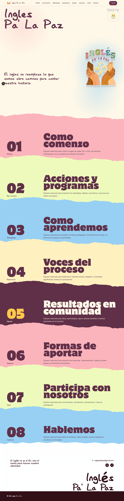
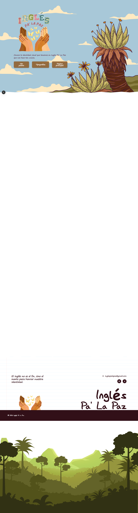

# Inglés Pa' La Paz

Un concepto web en desarrollo para presentar **Inglés Pa' La Paz**, un proyecto de aprendizaje de inglés que pone en el centro la calma, la identidad y la comunidad.



## Estado del proyecto

> **Concepto en desarrollo.** Todavía falta incorporar bastante contenido y funcionalidad para que se convierta en una landing page completa.

La estructura visual y de navegación ya está disponible. El contenido de las secciones se irá incorporando progresivamente: historia, programas, metodología, experiencias, impacto, formas de aportar y contacto.

Por ahora, la vista [`/estilos`](#vistas) es el nodo más desarrollado: documenta la identidad visual del proyecto y sirve como referencia para continuar construyendo el resto del sitio.

## Vistas

| Ruta | Descripción |
| --- | --- |
| `/landing` | Landing principal con la narrativa y las secciones del proyecto. |
| `/estilos` | La vista más desarrollada hasta ahora: guía de identidad con logo, paleta, tipografía y tecnologías. |



## Tecnologías

- [Next.js](https://nextjs.org/) con App Router
- React y TypeScript
- Tailwind CSS
- Framer Motion
- pnpm como gestor de paquetes

## Ejecutarlo localmente

```bash
pnpm install
pnpm dev
```

Abre [http://localhost:3000](http://localhost:3000). La ruta principal redirige a `/landing`.

### Comprobaciones

```bash
pnpm lint
pnpm build
```

## Estructura

```txt
src/
  app/        # Rutas, layout y estilos globales
  features/   # Pantallas y componentes por funcionalidad
  shared/     # Componentes y configuración reutilizables
public/       # Logos, fuentes y capturas del proyecto
```

## Identidad visual

La interfaz utiliza una paleta suave inspirada en la marca: rosa, verde claro, azul cielo y beige. Las variables de color, tipografías y estilos globales viven en [`src/app/globals.css`](src/app/globals.css).

---

Desarrollado para **Inglés Pa' La Paz**.
